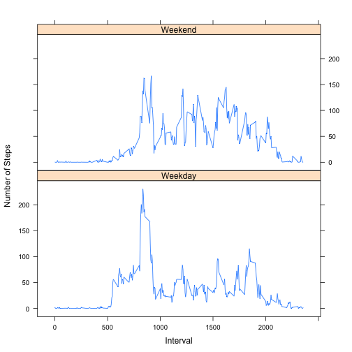

R---
title: "Reproducible Research: Peer Assessment 1"
output: 
  html_document:
    keep_md: true
---


## Loading and preprocessing the data

A straightforward command to read in the activity Data Frame from the provided zip file

```r
activity_df <- read.csv(unz("activity.zip", "activity.csv"))
```


Let's look at a histogram of the total number of steps taken each day:


```r
hist(activity_df$steps,xlab="Steps",main="Steps Taken Each Day by Frequency")
```

 

```r
steps_by_day <- tapply( activity_df$steps ,activity_df$date, sum,na.rm=TRUE)

mean_steps_per_day   <- round(mean(steps_by_day))
median_steps_per_day <- median(steps_by_day)
```

Mean steps per day : 9354

Median steps per day: 10395


### What is the average daily activity pattern?

Let's make a time series plot of the 5-minute intervals by the average number of steps taken, averaged across all the days.


```r
steps_by_interval <- tapply( activity_df$steps ,activity_df$interval, sum,na.rm=TRUE)
intervals         <- rownames(steps_by_interval)

plot(
    intervals,
    steps_by_interval,
    main =  "Average Steps Taken Per 5-Minute Interval" ,
    xlab = "In`terval",
    ylab = "Steps",
    type = "l"
)
```

 

```r
max_steps       <- max(steps_by_interval)
which_max_steps <- intervals[ which.max(steps_by_interval) ]
```
The five-minute interval 835 is the interval with the highest number of steps averaged across all days with 10927.


### Imputing missing values

How much missing data values (NA) are there?


```r
num_of_nas <- sum(is.na(activity_df$steps))
```
The number of NA values in the dataset is 2304 out of 17568.


Let's estimate the missing values replacing each NA value with the average of the value for that particular interval.


```r
##Find the mean for every interval
mean_steps_by_interval <- tapply(activity_df$steps,activity_df$interval, function(x) { round(mean(x,na.rm=TRUE)) } )

##loop through the DF , if the value is NA then replace it with the mean value for that interval, else just copy
estimated_steps <- vector()
for(i in seq(along=activity_df$steps)) {
    if( is.na(activity_df$steps[i] )) {
        estimated_steps <- c(estimated_steps,mean_steps_by_interval[ as.character(activity_df[i,"interval" ]) ] )
    } else {
        estimated_steps <- c(estimated_steps,activity_df$steps[i])
    }
}

#make a copy of the DF and replace the steps vector with the new estimated steps
activity_df_estimated <- activity_df
activity_df_estimated$steps <- estimated_steps
```

What does the new histogram look like now that the NA values have been replace?


```r
hist(activity_df_estimated$steps,xlab="Steps",main="Steps Taken Each Day by Frequency")
```

 

```r
steps_by_day <- tapply( activity_df_estimated$steps ,activity_df_estimated$date, sum,na.rm=TRUE)

estimated_mean_steps_per_day       <- round(mean(steps_by_day))
estimated_median_steps_per_day <- median(steps_by_day)
```
Mean steps per day : 1.0766 &times; 10<sup>4</sup>

Median steps per day: 1.0762 &times; 10<sup>4</sup>


### Are there differences in activity patterns between weekdays and weekends?

Let's use dplyr to add a new factor for weekday/weekend and lattice to plot the weekend/weekday data.


```r
library(dplyr)
```

```
## 
## Attaching package: 'dplyr'
## 
## The following object is masked from 'package:stats':
## 
##     filter
## 
## The following objects are masked from 'package:base':
## 
##     intersect, setdiff, setequal, union
```

```r
activity_df_estimated <-
    mutate(activity_df_estimated ,
           weekdays =
               ifelse(
                   weekdays(as.Date(activity_df_estimated$date)) == "Saturday" |
                   weekdays(as.Date(activity_df_estimated$date)) == "Sunday" 
                  ,"Weekend","Weekday")
           )

activity_df_estimated$weekdays <- as.factor(activity_df_estimated$weekdays)

weekdays_average_steps <- aggregate(steps ~ interval+weekdays , activity_df_estimated , mean)

library(lattice)
xyplot( steps ~ interval  | factor(weekdays)
      ,data=weekdays_average_steps,type="l",
       xlab = "Interval",
       ylab = "Number of Steps",
       layout=c(1,2)
       )
```

 

We can see that there are differences between the weekdays and weekends.
Steps start earlier on the weekdays and spike faster (presumably to get to work/school/etc).

